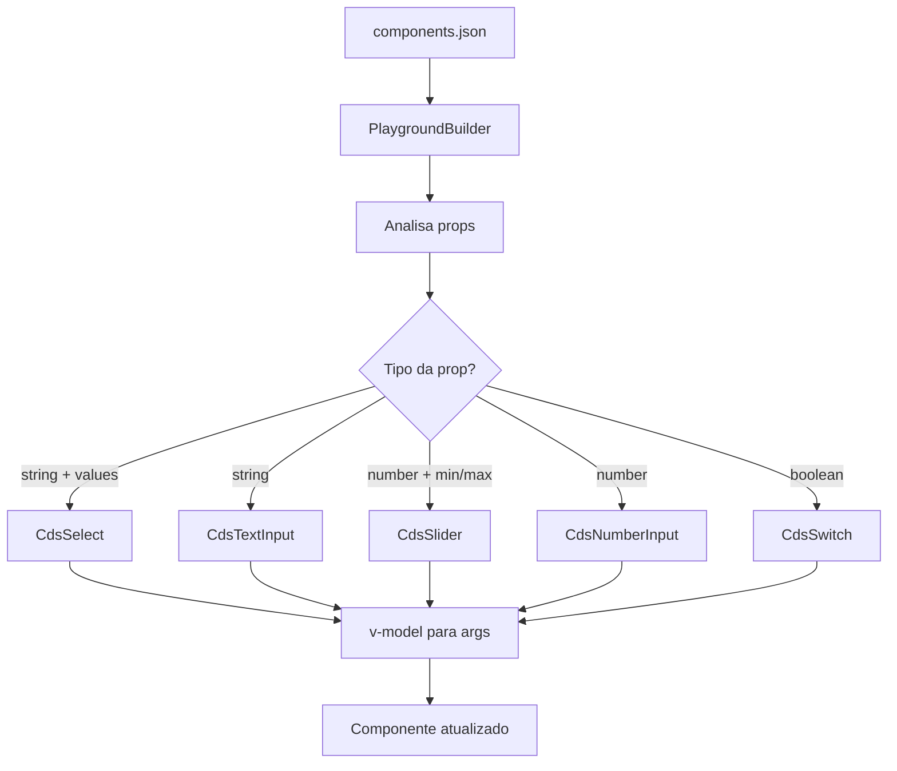

# PlaygroundBuilder

### Sistema de controles interativos que gera automaticamente inputs para manipular props dos componentes
---

O **PlaygroundBuilder** é um componente inteligente que analisa as props de um componente e gera automaticamente controles interativos apropriados para cada tipo de propriedade. Ele permite que os usuários experimentem e testem diferentes configurações dos componentes em tempo real.

## Quando usar

- Para criar controles interativos automáticos para props de componentes
- Quando precisar de um playground dinâmico baseado em metadados
- Para permitir experimentação em tempo real com componentes
- Sempre que quiser evitar criar controles manuais para cada prop

## Como funciona

O componente lê os metadados do componente especificado (via `components.json`), analisa cada prop e gera automaticamente o tipo de controle mais apropriado baseado no tipo da propriedade (string, number, boolean, enum, etc.).

---

## Uso

### Uso básico
```vue
<script setup>
const buttonArgs = ref({
  variant: 'primary',
  size: 'md', 
  disabled: false,
  text: 'Clique aqui'
});
</script>

<PlaygroundBuilder
  v-model:args="buttonArgs"
  component="Button"
/>
```

### Integrado no PreviewBuilder
```vue
<!-- PlaygroundBuilder é usado automaticamente pelo PreviewBuilder -->
<PreviewBuilder
  :args="componentArgs"
  component="CdsButton"
  :events="['button-click']"
  <!-- PlaygroundBuilder será renderizado automaticamente -->
/>
```

---

## Props

| Nome | Tipo | Default | Descrição |
|------|------|---------|-----------|
| `component` | `string` | - | Nome do componente para buscar metadados |
| `args` | `Object` | - | Objeto com valores das props (v-model) |

---

## Eventos

| Nome | Descrição |
|------|-----------|
| `update` | Emitido quando alguma prop é alterada |

---

## Tipos de controles gerados

O PlaygroundBuilder gera diferentes tipos de controles baseado no tipo da prop:

### 🔢 Propriedades numéricas (`number`)
- **NumberInput**: Para valores numéricos simples
- **Slider**: Quando as props têm `min` e `max` definidos
  - Calcula automaticamente o `step` como `max / 20`
  - Exibe valor em tempo real

### 🔤 Propriedades string
- **Select**: Quando há valores específicos disponíveis (enum)
  - Formata automaticamente as opções do array `values`
  - Extrai strings entre aspas simples
- **TextInput**: Para strings livres

### ✅ Propriedades boolean
- **Switch**: Para valores true/false

### 🎛️ Controles inteligentes
- Detecta automaticamente o melhor tipo de controle
- Respeita valores padrão definidos no componente
- Atualiza em tempo real via v-model

---

## Formatação automática de dados

### Parsing de valores padrão
```javascript path=null start=null
// O componente analisa diferentes formatos de valores padrão:
'null' → ''
'true' → true  
'false' → false
'[]' → ''
"'primary'" → 'primary'
'"secondary"' → 'secondary'
'42' → 42
```

### Normalização de tipos
- Strings são limpas de aspas desnecessárias
- Números são convertidos automaticamente
- Booleans são parseados corretamente
- Arrays vazios são convertidos em strings vazias

---

## Exemplos de controles

### Propriedade enum (Select)
```json
{
  "name": "variant",
  "type": { "name": "string" },
  "values": ["'primary'", "'secondary'", "'danger'"],
  "defaultValue": { "value": "'primary'" }
}
```
Gera: **CdsSelect** com opções Primary, Secondary, Danger

### Propriedade numérica com range (Slider)  
```json
{
  "name": "opacity",
  "type": { "name": "number" },
  "min": 0,
  "max": 100,
  "defaultValue": { "value": "50" }
}
```
Gera: **CdsSlider** de 0 a 100 com step 5

### Propriedade boolean (Switch)
```json
{
  "name": "disabled", 
  "type": { "name": "boolean" },
  "defaultValue": { "value": "false" }
}
```
Gera: **CdsSwitch** para true/false

### Propriedade string livre (TextInput)
```json
{
  "name": "placeholder",
  "type": { "name": "string" },
  "defaultValue": { "value": "'Digite aqui...'" }
}
```
Gera: **CdsTextInput** para entrada livre

---

## Layout e apresentação

### Estrutura visual
```scss path=null start=null
.inputs-container {
  padding: 4px 24px;
}

.preview-line {
  height: 36px;
  display: flex;
  justify-content: space-between;
  align-items: center;
}

.prop-name {
  font-weight: 600;
}
```

### Customizações de inputs
```scss path=null start=null
:deep(.base-input__field) {
  height: 32px !important;
  font-size: 12px;
}
```

---

## Lógica interna

### Processamento de props
```javascript path=null start=null
// Normaliza dados das props vindos do components.json
const normalizedPropsData = ref({});

// Para cada prop do componente:
propsData.value.map((propData) => {
  let rawValue = propData.defaultValue?.value;
  
  // Parse baseado no tipo e valor
  if (rawValue === 'null' || rawValue === null) {
    parsedValue = '';
  } else if (rawValue === 'true') {
    parsedValue = true;
  } else if (rawValue === 'false') {
    parsedValue = false;
  } else if (typeof rawValue === 'string') {
    // Remove aspas e limpa string
    const match = rawValue.match(/'([^']+)'/);
    parsedValue = match ? match[1] : rawValue.replace(/['\"]/g, '');
  }
  
  // Converte números
  if (!isNaN(parsedValue) && isFinite(parsedValue)) {
    parsedValue = Number(parsedValue);
  }
  
  return { [propData.name]: parsedValue };
});
```

---

## Integração com componentes

### CdsSlider (para números com range)
```vue path=null start=null
<CdsSlider
  v-model="normalizedPropsData[index][data.name]"
  :min="data.min"
  :max="data.max" 
  :step="data.max / 20"
  withText
/>
```

### CdsSelect (para enums)
```vue path=null start=null
<CdsSelect
  v-model="normalizedPropsData[index][data.name]"
  :options="formatOptions(data.values)"
  returnValue
  label=""
/>
```

### CdsSwitch (para booleans)
```vue path=null start=null
<CdsSwitch
  v-model="normalizedPropsData[index][data.name]"
/>
```

### CdsTextInput (para strings)
```vue path=null start=null
<CdsTextInput
  v-model="normalizedPropsData[index][data.name]"
  label=""
  lazy
/>
```

---

## Dependências

O componente utiliza:
- `CdsTextInput` - Inputs de texto
- `CdsNumberInput` - Inputs numéricos  
- `CdsSelect` - Seletores de opção
- `CdsSwitch` - Controles boolean
- `CdsSlider` - Sliders para ranges
- `CdsText` - Labels dos controles
- `docs/.docgen/components.json` - Metadados dos componentes

---

## Utilitários internos

### formatOptions()
```javascript path=null start=null
function formatOptions(val) {
  return val.map(v => ({
    id: v.match(/'(\S+)'/) !== null ? v.match(/'(\S+)'/)[1] : v,
    value: v.match(/'(\S+)'/) !== null ? v.match(/'(\S+)'/)[1] : v,
  }))
}
```

### capitalize()
```javascript path=null start=null
function capitalize(str) {
  return str?.[0]?.toUpperCase() + str?.slice(1) ?? '';
}
```

---

## Fluxo de dados



---

## Notas importantes

- ⚠️ **Exclusivo para documentação** - Não usar em aplicações
- Requer dados válidos em `components.json`
- Funciona apenas com props que têm metadados apropriados
- Os controles são gerados dinamicamente na montagem
- Suporte a lazy loading para performance
- Sincronização bidirecional com o componente pai

---

## Tipos TypeScript

```typescript path=null start=null
export type PlaygroundBuilderType = typeof import("./PlaygroundBuilder.vue")["default"];

interface Props {
  component: string;
  args?: Object;
}

interface Emits {
  (e: 'update'): void;
}
```